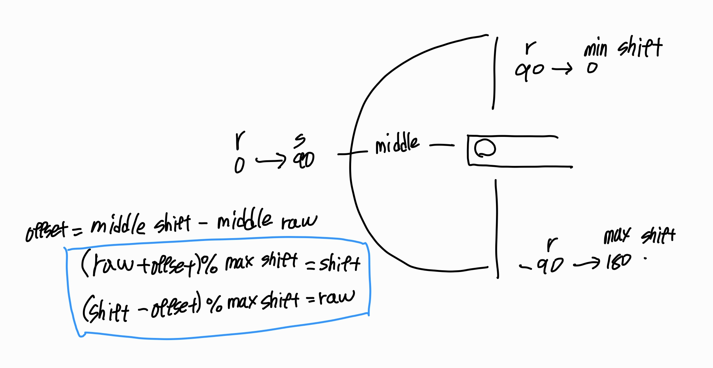
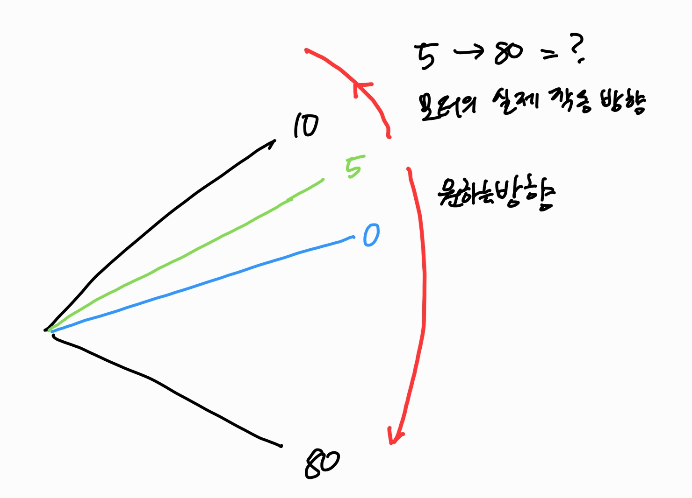

서보는 자신이 관절의 가용 범위내 어느 상태인지 모른다. 0~4095의 값으로 읽을 뿐이고,
어디 부터 어디까지가 관절의 물리적 한계인지 어디가 중앙인지는 centering 과 offset 으로 정해줘야 한다.

손목을 여기서 90도 돌린다. 라고 가정했을때 "여기" 가 어딘지 90도는 얼만큼인지 우리는 눈으로 보고 대강 상상할 수 있지만 로봇은 그렇지 못한다. 모터는 그냥 자신의 현재 위치를 분해능으로 저장하고 있을 뿐이다. 

또한, [아래](#문제-발생)와 이 관절이 돌아가면서 심(0 == 4096)부분을 지나는 상황이라면 좀 더 까다로워 진다.

3000 에서 200 까지 간다고 할때 컴퓨터는 3000 에서 각을 빼가며 200 에 도달 하는것을 최단으로 생각 하지만 사실은 4000을 넘어 0에 도달해 200까지 가야 물리적으로 맞는 경우가 있기 때문이다.


리매핑의 예시 90~ -90 을 0 ~ 180 으로 맞추는 과정



토크를 끄고
1. 각 관절의 조인트를 중앙으로 배치하여 offset 값을 얻는다. (중앙값은 max_raw//2 = **2048**)
	1. 여기서 max_raw는 4096이다. raw의 최대 값이 아니라 **값의 개수 개념**이다.
2.  관절을 **손으로** 끝까지 움직여가며 `read_position`으로 raw를 읽어 기록한다.

위그림 처럼 이제 shift 값과 raw값을 오가며 설정이 가능해졌다.
조작 시엔 **raw 를 받아 shift 로 변형** 후 조작 한뒤 다시 raw 로 값을 쓰는 형태이다.
- `raw읽기 -> shift(조작) -> raw쓰기`

## centering

서보의 심은 중앙값의 반대에 생긴다. 그러므로 중앙각을 2048 로 맵핑 해주면 특수한 경우(360도 회전)를 제외 하고 관절의 반경 안에서 심을 넘어 다닐 수가 없다.

raw -> shift -> rad -> degree 순으로 변환하는 함수를 제작 해 주었다.

```bash
2203, 2067, 0.03, 1.67
2196, 2060, 0.02, 1.05
2188, 2052, 0.01, 0.35
2181, 2045, -0.00, -0.26
2173, 2037, -0.02, -0.97
2166, 2030, -0.03, -1.58
```

그렇게 얻은 값들은 json으로 저장 했다.
```json
{
    "1": {
        "name": "shoulder_pan",
        "offset": -136,
        "shifted_min": 854,
        "shifted_max": 3189
    },
    "2": {
        "name": "shoulder_lift",
        "offset": 1084,
        "shifted_min": 819,
        "shifted_max": 3112
    },
    "3": {
        "name": "elbow_flex",
        "offset": -1077,
        "shifted_min": 903,
        "shifted_max": 3085
    },
    "4": {
        "name": "wrist_flex",
        "offset": -2039,
        "shifted_min": 846,
        "shifted_max": 3137
    },
    "5": {
        "name": "wrist_roll",
        "offset": 1996,
        "shifted_min": 106,
        "shifted_max": 3904
    },
    "6": {
        "name": "gripper",
        "offset": -590,
        "shifted_min": 2049,
        "shifted_max": 3247
    }
}
```

## 문제 발생

위의 리 매핑 방식은 역산 해서 raw값을 바로 읽어낼 순 있지만
wirtePosEx 로 모터를 회전 시킬때 일부 관절이 방향을 찾지 못하는 현상이 일어났다
매핑은 기구학적 값을 제공하는것에 의의가 있고 wirtePosEx 를 사용 하는 모터의 회전은 **목표** 를 기준으로 그 값에 도달 하기위해 움직인다.




## 방법 2.

결국 메모리 ofs를 새로 저장하기로 했다

일단 손으로 관절을 중앙으로 이동해 ofs를 메모리에 저장한다.
이때 손으로 정하는 중앙은 조금 부정확할 수 있기 때문에
$min + (min-max)/2$ 을 이용하여 상대적으로 **정확한 중앙값을 구해 모터를 해당 위치로 이동** 시키고 그값을 다시 새겨 주었다. **심이 관절의 가동범위 밖에 있다는 전제**에서 가능한 센터링 방식이다.
이러면 굳이 shift값 을 저장해놓고 사용 하는 번거로운 수식이 전부 사라진다.

1. 손으로 중앙 이동 -> write(id,40,128)
2. min, max 도출 -> 절대 중앙값(raw) 저장
3. 중앙으로 이동 -> write(id,40,128)
