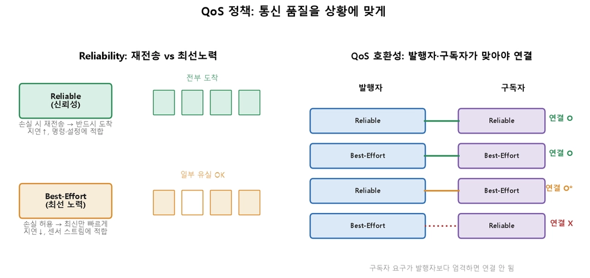

ROS2 노드는  **이벤트 구동(event-driven)** 
- 이벤트가 생기면 함수를 부른다.
    - **구독** 콜백: 토픽 메시지 도착 시
    - **타이머** 콜백: 정해진 주기마다
    - **서비스** 콜백: 다른 노드 요청 시
- 콜백은 **콜백 대기열**에 쌓이고, 꺼내서 실제로 실행·분배하는 주체가 **executor**. `rclpy.spin(node)`가 executor에게 보내는 시작 신호

> 기본 executor는 **단일 스레드**(콜백 하나씩) — 멀티 스레드 executor는 병렬 처리

- **콜백 블로킹**: 콜백 하나가 오래 걸리면 나머지가 전부 밀림
    - 예: 인지 콜백 80ms 처리 → 20ms 주기여야 할 제어 콜백이 못 돎 → "제어가 갑자기 버벅인다"
    - 예방: 콜백은 짧게, `sleep`·블로킹 I/O·무한 대기 금지
- 여러 콜백을 동시에 돌리려면 `MultiThreadedExecutor` + **콜백 그룹**
    - `MutuallyExclusive`(상호 배타): 같은 데이터 다루는 콜백을 묶어 경쟁 상태(race condition) 방지
    - `Reentrant`(재진입): 독립적인 콜백을 자유롭게 병렬 실행


- **큐 깊이**: 메시지를 얼마나 쌓아둘지 정하는 값. 발행자·구독자 생성 시 마지막 인자로 지정

```python
self.pub = self.create_publisher(Twist, '/cmd_vel', 10)  # (메시지타입, 토픽명, 큐깊이)
```

- 센서처럼 빠른 데이터는 쌓아두지 말고 최신 것만(큐 작게) — 느린 네트워크에서 계속 쌓이면 프로그램 부하로 이어짐
- CLI로 통신 상태 확인·디버깅:

```bash
ros2 topic list                                   # 토픽 목록
ros2 topic pub /cmd_vel geometry_msgs/msg/Twist "{linear: {x: 0.2}}" --rate 10  # 1회성 발행(디버깅)
ros2 run rqt_graph rqt_graph                 # 노드-토픽 연결 그래프
```


#### Service
- 짧은 정보 처리
- 요청 -> 응답 왕복 통신
#### Action
- 상대적으로 오래걸림
- 중간 취소가 필요한 작업

## QoS 정책
통신 품질을 상황에 맞게 정하는 ROS2정책




## Reliable
- 놓치면 안되는 중요한
- 유실을 허용 하지 않는다.
- 유실시 재전송해 반드시 모든 데이터를 받을 수 있게 한다.
## Best-effort
- 최신이 중요한 데이터
- 유실을 허용한다.
	
## Durability
-  구독자가 늦게 접속 했을시 이전 데이터를 받을지
- `Volatile`: 접속 후 데이터만
- `Transient Local`: 발행자가 마지막 메시지 보관 → 늦은 구독자에게도 전달 (지도·로봇 설명처럼 늦어도 **중요한** 데이터)

| 프로파일            | 구성                                 | 용도            |
| --------------- | ---------------------------------- | ------------- |
| **Default**     | Reliable, Volatile, KeepLast(10)   | 일반 통신(명령 등)   |
| **Sensor Data** | Best-Effort, Volatile, KeepLast(5) | 카메라·LiDAR 스트림 |
| **Services**    | Reliable                           | 서비스 통신        |
| **Parameters**  | Reliable                           | 파라미터          |

## TF2 좌표 변환

- 각 관절·센서는 base 기준에서 계속 달라지는 좌표를 가짐 → 이 관계를 관리·변환해주는 것이 **TF2**
- 표준 계층(트리 구조): `map`(전역 고정) → `odom`(엔코더 기반 주행 기준) → `base_link`(로봇 몸체) → 센서 링크들
