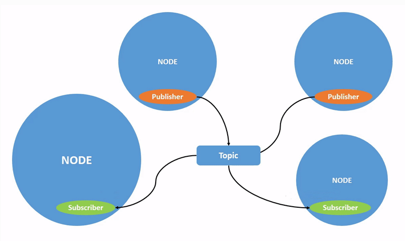
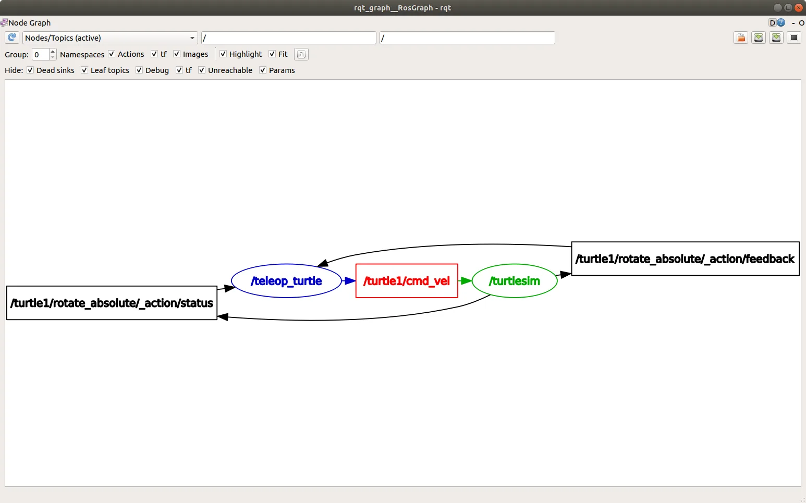
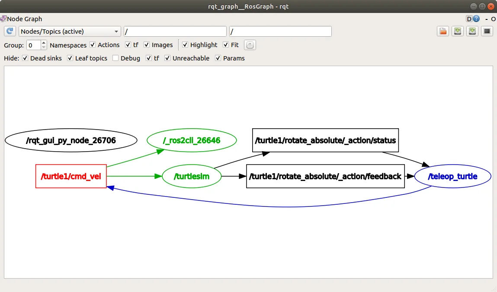
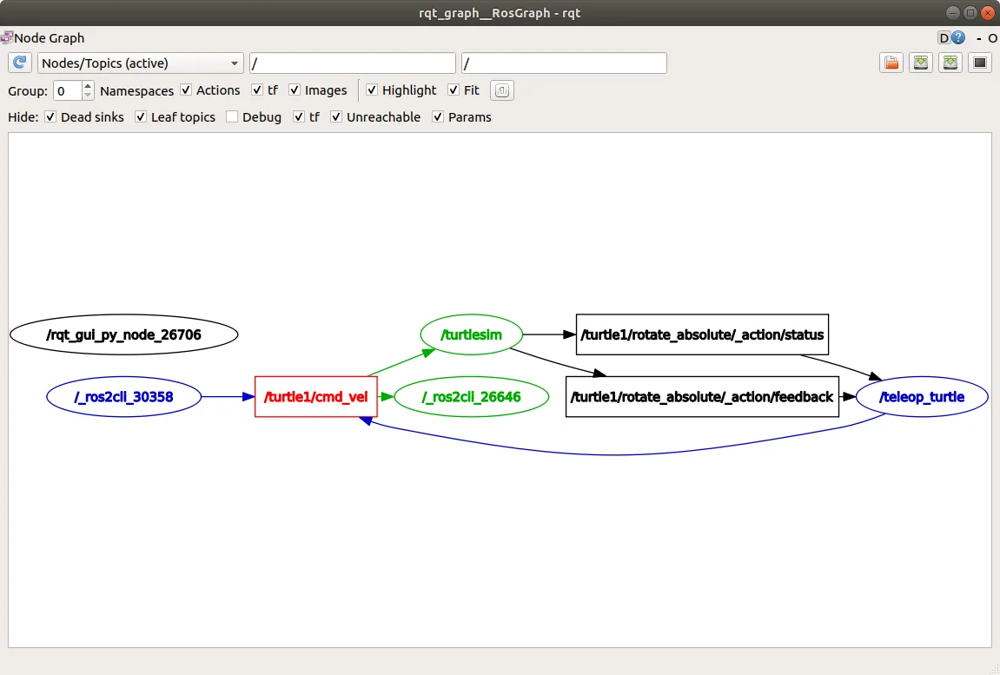

- 토픽은 노드와 노드 사이 메세지가 통과하는 통로

`publisher` -msg-> `topic` -msg-> `subscriber`



- 노드는 여러 토픽에 발행할 수 있다.
- 노드는 여러 토픽을 구독 할 수 있다.

## run rqt_gragh

노드, 토픽간의 **시각화**
```bash
ros2 run rqt_gragh rqt_gragh
```

`teleop_turtle` 과 `turtlesim` 은 각각 `/turtle/cmd_vel ` 을 발행,구독 하는것을 볼 수 있다.


## topic list

토픽 리스트
```bash
ros2 topic list
ros2 topic list -t #같은 토픽 목록 [토픽유형]
```

## topic echo

토픽에 발행 되는 데이터 보기
```bash
ros2 topic echo /토픽이름
```

`/_ros2cli_26646`는 `echo` 명령어를 실행한 후 생성된 노드이다. `teleop_turtle`가  `cmd_vel` 토픽을 통해 데이터를 발행하고 두 구독자가 이를 구독하고 있다는 것을 볼 수 있다.


```
ros2 topic info 토픽 --verbose
```
- 발행자와 구독자의 노드이름, 네임스페이스
- 토픽 유형
- QoS 프로필

## interface show

토픽 유형의 요소를 보고 싶을때
```bash
ros2 insterface show 토픽유형(geometry_msgs/msg/Twist)
```

```bash
#geometry_msgs/msg/Twist 의 요소 
    Vector3  linear
            float64 x
            float64 y
            float64 z
    Vector3  angular
            float64 x
            float64 y
            float64 z
```
같은 토픽을 발행, 구독 하는 노드는 같은 타입의 토픽 유형을 공유 한다.

## topic pub

토픽을 반환
`'<args>'`  인수는 토픽에 전달할 실제 데이터이며 이전 섹션에서 발견한 구조

```bash
ros2 topic pub <topic_name> <msg_type> '<args>'

# 예시
# 옵션이 없으면 1Hz로 발행
ros2 topic pub /turtle1/cmd_vel geometry_msgs/msg/Twist "{linear: {x: 2.0, y: 0.0, z: 0.0}, angular: {x: 0.0, y: 0.0, z: 1.8}}"
# --once 는 단 한번만 
ros2 topic pub --once -w 2 /turtle1/cmd_vel geometry_msgs/msg/Twist "{linear: {x: 2.0, y: 0.0, z: 0.0}, angular: {x: 0.0, y: 0.0, z: 1.8}}"
```

임시로 만든 `topic pub` 노드가 `turtle1/cmd_vel` 로 발행 하는 모습



## topic hz

데이터가 발행 되는 속도
```bash
ros2 topic hz 토픽
```

## topic bw

토픽이 사용하는 대역폭
```
ros2 topic bw 토픽
```
> [!warning] 
> 대역폭은 `ros2 topic bw` 명령어로 생성된 구독에서 수신된 속도를 반영하며 플랫폼 자원과 QoS 설정에 영향을 받아 발행자의 대역폭과 정확히 일치하지 않을 수 있다.

## ros2 topic find

주어진 유형의 사용 가능한 토픽 목록
```bash
ros2 topic find <topic_type>
```

예시
```bash
#geometry_msgs/msg/Twist
ros2 topic find geometry_msgs/msg/Twist
/turtle1/cmd_vel
```

---
[02-4. 토픽(Topics) 이해하기 - ROS 2 Humble 입문](https://wikidocs.net/333526)