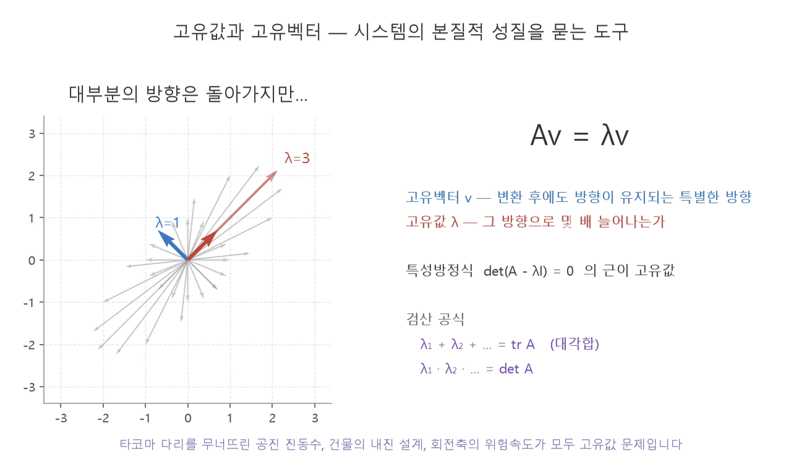

선형변환에 A에 의한 변환 결과가 자기 자신의 *상수배가 되는 0이 아닌 벡터* 를
**고유벡터**라 하고 상수배값을 **고유값** 이라 한다.

- $A$ 에 대해 $Av = \lambda v$ 를 만족하는 0이 아닌 
	- $v$ = 고유벡터
	- 상수 $\lambda$ = 고유값

예를 들면,
$2*(1,2) = (2,4)$ 에서
고유벡터: (2,4)
고유값: 2

### scale
선형 변환A 에 의해 *방향은 달라지지 않고 크기만 늘어나는 고유벡터* 에서의 *고유값은 크기*일 것이다.
### rotation
회전 변환에 의해 변하지 않는 고유벡터는 최전축 벡터이고 그 고유값은 1이다 — 이 축을 뽑아내는 방식이 axis-angle 표현의 수학적 근거다.

## 고유벡터와 회전축

3차원 회전행렬 $R$이 실제로 고유값·고유벡터를 가지면 어떤 값이 나오는지, [특성방정식](./characteristic_equation.md)으로 직접 구해보면 답이 나온다.

**특성방정식(characteristic equation)**: $Av=\lambda v$를 정리하면 $(A-\lambda I)v=0$.

$v\ne 0$인 해가 존재하려면 $(A-\lambda I)$가 [특이행렬](./inverse_column_null_space.md)이어야 하므로

$$\det(A-\lambda I)=0$$

이 $n$차 다항방정식의 근이 곧 고유값들이다.

**검산 공식**: $\sum_i \lambda_i = \operatorname{tr} A$(대각합), $\prod_i \lambda_i = \det A$. 계산 실수를 바로 잡아낼 수 있어 외워둘 만하다.

가장 쉬운 경우인 z축 회전으로 직접 확인해보자.

$$R_z(\theta)=\begin{bmatrix}\cos\theta & -\sin\theta & 0\\\\ \sin\theta & \cos\theta & 0\\\\ 0&0&1\end{bmatrix}$$

이 행렬은 2×2 회전 블록과 $[1]$ 블록이 붙어있는 모양이라 고유값도 따로 논다. z축 방향 $(0,0,1)$은 곱해도 그대로 자기 자신이 나오니 $\lambda=1$. 2×2 블록의 특성방정식 $\lambda^2-2\cos\theta\,\lambda+1=0$을 풀면 $\lambda=\cos\theta\pm i\sin\theta$가 나온다. 일반 축 기준 회전도 그 축을 z축으로 두는 정규직교 좌표계로 바꾸면(orthogonal similarity라 고유값은 그대로 보존) 항상 이 꼴로 환원되므로, 결국 임의의 3차원 회전행렬 $R$의 고유값은

$$\lambda_1 = 1\ \text{(실수)}, \qquad \lambda_{2,3} = \cos\theta \pm i\sin\theta\ \text{(켤레복소수)}$$

**$\lambda=1$인 고유벡터가 곧 회전축이다** — $R\mathbf n=\mathbf n$, 즉 그 축 위의 벡터는 회전을 시켜도 방향·크기가 그대로이기 때문. 위 rotation 절에서 "회전 변환에 의해 변하지 않는 고유벡터는 회전축"이라 한 게 여기서 특성방정식으로 확인되는 셈이다.

나머지 두 복소 고유값 $\cos\theta+i\sin\theta$는 사실 [2D 회전=복소수 곱셈 동형사상](./complex_rotation_isomorphism.md) 그 자체다($e^{i\theta}$) — 위에서 뽑아낸 2×2 회전 블록의 고유값이 복소수로 나오는 게 우연이 아니라, 그 동형사상이 특성방정식 위로 그대로 드러난 것이다. 편각이 곧 회전각 $\theta$고, 대각합에서 바로 읽힌다.

$$\operatorname{tr} R = 1+2\cos\theta \implies \theta=\arccos\frac{\operatorname{tr}R-1}{2}$$

이게 **오일러 회전 정리**("모든 3D 회전은 하나의 축을 중심으로 한 회전이다")의 선형대수적 증명이다 — 로드리게스 공식이 축 $\hat\omega$를 미분방정식으로 "구성"해서 회전행렬을 만들어냈다면, 고유값 문제는 거꾸로 이미 주어진 회전행렬에서 그 축을 "추출"해내는 길이다.
