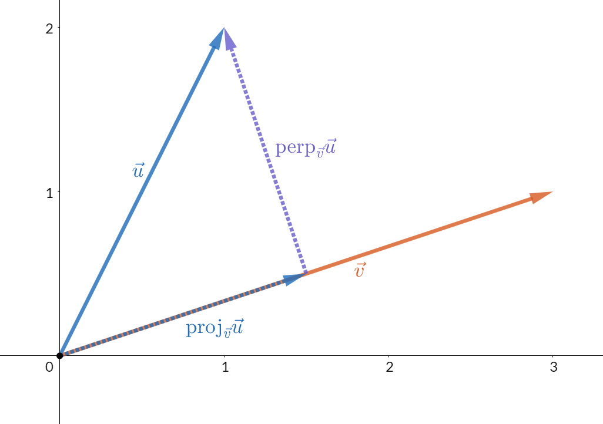

$$\frac{\vec{u}\cdot \vec{v}}{\vec{v} \cdot \vec{v}}\vec{v}$$

$\theta$ 를 이용해 두 벡터의 정사영을 그리는 공식

위 그림을 기준으로
$u$ 벡터에서 $v$ 벡터 위로 **직교**하는 수선의 발을 내렸을때 $proj_vu$ 라고 표기한다.
이때 $proj_vu$ 의 식은

$$proj_vu = \frac{\vec{u}}{\left||\vec{v}\right||^2}$$
이식을 풀어보자
벡터는 두가지가 필수다 **방향**과 **크기**

### 방향
---
일단, **방향**은 **정규화**된 $\vec{v}$ 과 동일하다.
그러므로,

**방향** = $\frac{\vec{v}}{\left||\vec{v}\right||}$

### 길이
---

길이는 직각 삼각형의 밑변의 길이와 동일 하기 때문에
cos 법칙으로 알아 낼 수 있다.
cos 법칙에 따르면

$cos\theta = \frac{밑변}{빗변}$  

이때, 빗변을 양 변에 곱해 준다면

$cos\theta빗변 = 밑변$ 

이 된다.
즉, 빗변은 $\vec{u}$ 의 길이 이므로

**길이** = $cos\theta\left||\vec{u}\right||$ 

### 정리
---

벡터  = 방향\*크기 이므로

$cos\theta\left||\vec{u}\right||\frac{\vec{v}}{\left||\vec{v}\right||}$

가 된다.
여기서 $cos\theta$ 는 [코사인 유사도](./cosine_similarity.md) 로 치환 된다.

$\frac{u\cdot v}{\left||\vec{u}\right||\left||\vec{v}\right||}\left||\vec{u}\right||\frac{\vec{v}}{\left||\vec{v}\right||}$

$\left||\vec{u}\right||$ 는 지워지고

$\frac{u\cdot v}{\left||\vec{v}\right||}\frac{\vec{v}}{\left||\vec{v}\right||}$
$\frac{u\cdot v}{\left||\vec{v}\right||^2}\vec{v}$

$\left||\vec{v}\right||^2$는
$\vec{v} \cdot \vec{v}$ 로 치환 된다.
그러므로

$\frac{\vec{u}\cdot \vec{v}}{\vec{v} \cdot \vec{v}}\vec{v}$
로 마무리 된다.
