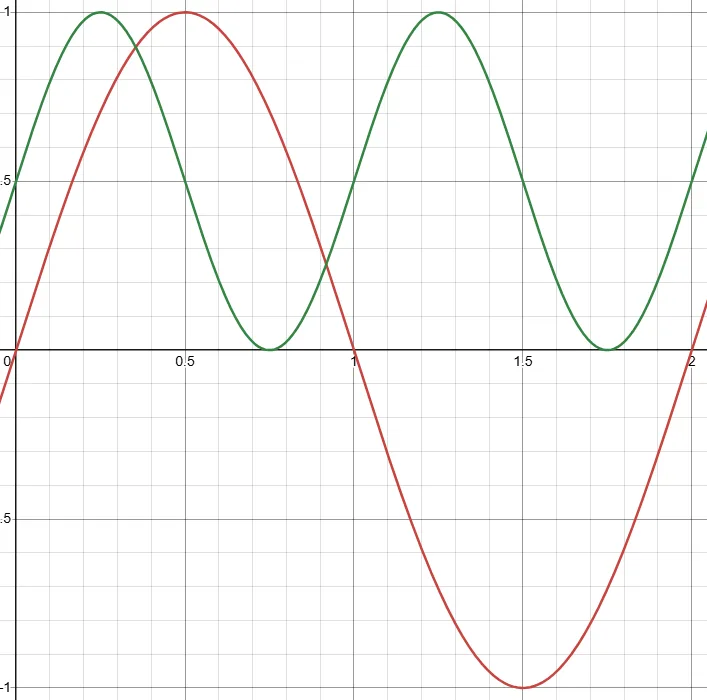

입력값 $t \in [0, 1]$을 원하는 곡선 형태로 바꿔주는 함수들. 셰이더나 애니메이션 커브에서 값의 흐름을 다듬을 때 쓴다.

## Smoothstep

$$S(t) = 3t^2 - 2t^3$$

양 끝점에서 $S'(0) = S'(1) = 0$이라 앞뒤 구간과 자연스럽게 이어진다. 가장 많이 쓰이는 셰이핑 함수.

Ken Perlin의 Smoother Step은 2차 미분까지 0이 되도록 확장한 버전이라 더 부드럽다.

$$S(t) = 6t^5 - 15t^4 + 10t^3$$

```hlsl
float t = saturate(t); // 0~1 클램프
float smooth  = t * t * (3.0 - 2.0 * t);
float smoother = t * t * t * (t * (t * 6.0 - 15.0) + 10.0);
```

## Power (Bias)

$$f(t) = t^n$$

- $n < 1$: 초반은 빠르고 후반은 느리다
- $n = 1$: 선형
- $n > 1$: 초반은 느리고 후반은 빠르다

```hlsl
float f = pow(t, n);
```

## Parabola

$$f(t) = \left(4t(1-t)\right)^n$$

$t=0$과 $t=1$에서 0, $t=0.5$에서 최댓값 1이 되는 포물선 형태. 펄스나 bump 형태를 만들 때 유용하다.

```hlsl
float f = pow(4.0 * t * (1.0 - t), n);
```


## Gain

$$
g(t, k) =
\begin{cases}
\dfrac{f(2t,\, k)}{2} & t < 0.5 \\\\[6pt]
1 - \dfrac{f(2 - 2t,\, k)}{2} & t \geq 0.5
\end{cases}
, \quad f(t, k) = t^k
$$

$t=0.5$를 기준으로 대칭인 S자 곡선. $k>1$이면 중간 구간이 급해지고, $k<1$이면 중간 구간이 평탄해진다.

```hlsl
float gain(float t, float k)
{
    float a = 0.5 * pow(2.0 * (t < 0.5 ? t : 1.0 - t), k);
    return t < 0.5 ? a : 1.0 - a;
}
```


## Triangle / Sawtooth Wave

Sawtooth: $f(t) = \mathrm{frac}(t \cdot n)$

Triangle: $f(t) = \left| 2\,\mathrm{frac}(t \cdot n) - 1 \right|$

반복 패턴을 만들 때 쓴다.

```hlsl
float sawtooth = frac(t * freq);
float triangle = abs(frac(t * freq) * 2.0 - 1.0);
```


## Sine 기반

$$f(t) = \sin(\pi t)$$

값을 $[0,1]$ 범위로 맞추려면:

$$f(t) = \frac{\sin(2\pi t) + 1}{2}$$

```hlsl
float bell       = sin(t * 3.14159265);
float oscillation = (sin(t * 6.28318530) + 1.0) * 0.5;
```



## Exponential

감쇠: $f(t) = e^{-kt}$

점근 상승: $f(t) = 1 - e^{-kt}$

$k$가 클수록 변화가 빠르다. 스프링이나 물리 기반 이징에 자주 쓰인다.

```hlsl
float decay = exp(-k * t);
float rise  = 1.0 - exp(-k * t);
```


> **NOTE — 왜 $e$인가**
> $e$(자연상수, $\approx 2.71828$)는 $\frac{d}{dt}e^t = e^t$, 즉 미분해도 자기 자신이 되는 유일한 함수다. 그래서 "변화율이 현재 값에 비례하는" 자연 현상(감쇠, 성장 등)을 가장 자연스럽게 표현한다.
