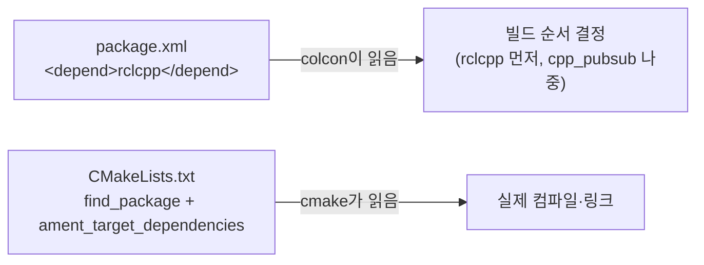
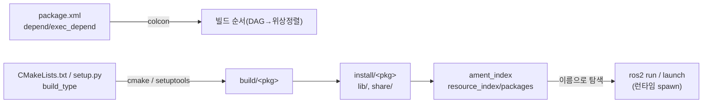

## 명령어
```bash
cd ~/ros_ws
colcon build
colcon build --packages-select <pkg>
colcon build --symlink-install   # launch/config/python 소스 수정시 재빌드 없이 반영
source install/setup.bash
```
### `install/setup.bash`
빌드 후 현재 쉘에 그것을 등록 해 줘야 한다.
`ros2 run` `ros2 launch`이런 명령어 들이 빌드된 것들을 찾을 수 있게
**쉘에 경로를 등록 시켜 주는 것이다.**

## 빌드 순서
- 각 패키지 `package.xml`의 `<depend>`/`<exec_depend>`로 DAG(Directed Acyclic Graph) 구성 → 위상정렬
- `exec_depend`(실행시점 의존)는 빌드 순서에 영향 없음

## build_type (`package.xml` → `<export><build_type>`)
- `ament_cmake` : `CMakeLists.txt`로 처리 (컴파일 있거나, 파일 설치 전용, C++)
- `ament_python` : `setup.py`로 처리 (컴파일 없음, 복사+스크립트 생성, python)

### ament_cmake `CMakeLists.txt`

구조
```bash
cpp_pubsub/ #패키지 : 빌드,설치,의존성 관리의 최소단위
├── package.xml # 메타데이터: 이름, 버전, 의존성
├── CMakeLists.txt # 빌드 규칙: 뭘 컴파일해서 뭘 만들지
├── src/ # .cpp 소스 파일
├── include/cpp_pubsub/ # 헤더 파일
└── launch/ # .launch.py 파일 (있는 경우)
```
패키지를 만들때 package.xml 과 CMakeLists.txt 2공간에 의존성을 부여 한다. 서로 다른 단계에서 읽히기 때문이다.




``` CMakeLists.txt
find_package(ament_cmake REQUIRED)
find_package(rclcpp REQUIRED)
...

#빌드 해야할 cpp
add_executable(노드이름 src/cpp)
#cpp를 위한 라이브러리
ament_target_dependencies(노드이름 rclcpp std_msgs ... ...)

add_executable(노드이름 src/cpp)
ament_target_dependencies(노드이름 rclcpp std_msgs ... ...)

#노드
install(
	TARGETS
	노드1
	노드2
	노드3
	DESTINATION lib/${PROJECT_NAME}
)

install(
	DIRECTORY
	launch
	DESTINATION share/${PROJECT_NAME}
)

ament_package() # 항상 마지막 호출, ament index 등록
```

### ament_python `setup.py`
```python
data_files=[
    ('share/ament_index/resource_index/packages', ['resource/' + package_name]),
    ('share/' + package_name, ['package.xml']),
],
entry_points={'console_scripts': ['talker = pkg.talker:main']},
```
- `entry_points` → 실행 스크립트 자동 생성: `install/<pkg>/lib/<pkg>/talker`

## ament index
- `share/ament_index/resource_index/packages/<pkg>` 마커 파일 유무로 `ros2 pkg list` / `ros2 run` / `FindPackageShare`가 패키지를 찾음
- 참조 경로는 항상 `install/`, `src/` 아님 → 소스 수정 후 재빌드(or `--symlink-install`) 필요

## 빌드→설치→실행 관계도


### 패키지별 실제 처리

**A) demo_cpp_pkg — ament_cmake, 진짜 컴파일이 있는 케이스**

| 단계 | 파일/명령 | 결과 |
|---|---|---|
| 의존성 탐색 | `find_package(rclcpp REQUIRED)` `find_package(std_msgs REQUIRED)` | `/opt/ros/humble`(언더레이)에서 헤더·라이브러리 경로 확보 |
| 컴파일 | `add_executable(listener src/listener.cpp)` | `build/demo_cpp_pkg/`에서 g++ 컴파일 → 오브젝트파일 + 바이너리 |
| 링크 | `ament_target_dependencies(listener rclcpp std_msgs)` | rclcpp/std_msgs의 include 경로·링크 플래그 자동 연결(직접 `-I`, `-l` 안 써도 됨) |
| 설치 | `install(TARGETS listener DESTINATION lib/${PROJECT_NAME})` | `install/demo_cpp_pkg/lib/demo_cpp_pkg/listener` 로 바이너리 복사 |
| 등록 | `ament_package()` | package.xml 복사, `resource_index/packages/demo_cpp_pkg` 마커 생성, `local_setup.bash` 등 환경훅 생성 |

→ `install/demo_cpp_pkg/lib/demo_cpp_pkg/listener` 가 `ros2 run demo_cpp_pkg listener`가 실행하는 실물.

**B) demo_py_pkg — ament_python, 컴파일 없이 "복사 + 스크립트 생성"만**

cmake 단계 자체가 없음 — `setup.py` + `setup.cfg`가 전부.

| setup.py 항목 | 하는 일 | install 결과 |
|---|---|---|
| `packages=find_packages()` | `demo_py_pkg/` 폴더(=`__init__.py` 있는 파이썬 패키지)를 통째로 site-packages로 설치 | `install/demo_py_pkg/lib/python3.10/site-packages/demo_py_pkg/talker.py` |
| `entry_points`의 `console_scripts: 'talker = demo_py_pkg.talker:main'` | setuptools가 `talker`라는 실행 가능 wrapper 스크립트를 자동 생성 | `install/demo_py_pkg/lib/demo_py_pkg/talker` ← `setup.cfg`의 `install_scripts=$base/lib/demo_py_pkg` 설정 때문에 이 위치로 옴(기본은 site-packages 옆이 아니라 관례상 `lib/<pkg>/`) |
| `data_files`의 `resource/demo_py_pkg` | 빈 마커 파일 하나를 복사 | `install/demo_py_pkg/share/ament_index/resource_index/packages/demo_py_pkg` — 이게 없으면 `ros2 pkg list`에 패키지가 안 잡힘 |

→ 파이썬 패키지는 "빌드"랄 게 사실상 없음. `ros2 run demo_py_pkg talker`가 실제로 실행하는 건 `install/.../lib/demo_py_pkg/talker`이고, 그 안에서 `demo_py_pkg.talker:main`을 import해서 호출.

**C) demo_bringup — ament_cmake인데 컴파일할 소스가 아예 없는 케이스**

```cmake
find_package(ament_cmake REQUIRED)
install(DIRECTORY launch config DESTINATION share/${PROJECT_NAME})
ament_package()
```

`add_executable`이 없으니 cmake는 컴파일러를 한 번도 안 부르고, 디렉토리 통째 복사 + ament 등록만 함:
- `src/demo_bringup/launch/demo.launch.py` → `install/demo_bringup/share/demo_bringup/launch/demo.launch.py`
- `src/demo_bringup/config/params.yaml` → `install/demo_bringup/share/demo_bringup/config/params.yaml`

`demo.launch.py` 안의 `FindPackageShare('demo_bringup')`은 **install/ 쪽 share 경로만** 찾고 `src/`는 안 봄 → 소스 수정 후 `colcon build`(또는 `--symlink-install`) 없이는 launch에 반영 안 됨.

### 패키지 간 연결
- **빌드 타임 연결은 없음** — 셋은 완전히 독립적으로 컴파일/설치됨
- **런타임 연결은 이름 기반 탐색.** `Node(package='demo_py_pkg', executable='talker', ...)`는 컴파일 링크가 아니라, `AMENT_PREFIX_PATH` 아래 `resource_index/packages/demo_py_pkg`를 찾아서 그 패키지의 `lib/demo_py_pkg/talker`를 **프로세스로 spawn**하는 것 → `package.xml`엔 `depend` 대신 `exec_depend`만 있어도 충분(컴파일 의존이 아니니까)
- **토픽(`chatter`) 연결은 DDS 런타임에서 이뤄짐** — launch가 두 노드에 같은 `remappings=[('chatter', topic)]`을 넘겨줘야 실제로 같은 토픽 이름으로 만남

### `source install/setup.bash`가 필요한 이유
빌드 산출물이 `install/<pkg>/lib`, `install/<pkg>/share`에 흩어져 있는데, `ros2 run`/`ros2 launch`가 이걸 찾으려면 `PATH`, `PYTHONPATH`, `AMENT_PREFIX_PATH` 같은 환경변수에 그 경로들이 등록돼야 함. `install/setup.bash`는 각 패키지가 만든 `local_setup.bash`(각 `install/<pkg>/share/<pkg>/local_setup.bash`)를 체이닝해서 이 환경변수들을 한 번에 세팅해주는 진입점.

---
참고: [About the Build System (ROS2 Humble Docs)](https://docs.ros.org/en/humble/Concepts/Advanced/About-Build-System.html)
