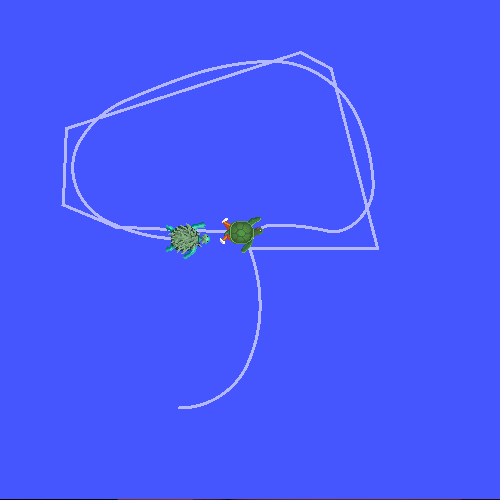
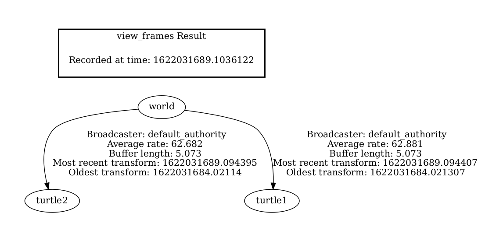

[Introducing tf2 — ROS 2 Documentation](https://docs.ros.org/en/foxy/Tutorials/Intermediate/Tf2/Introduction-To-Tf2.html)

로봇은 이동할 때마다 자신의 base 좌표를 다시 계산해야 하는데, ROS2에서는 tf2가 URDF를 참조해 이 좌표 변환을 자동으로 처리해준다.

> map - odom - baselink

튜토리얼 예제에서 tf2는 3개의 좌표 프레임(월드, 객체, 타겟)을 계산한다. broadcaster가 객체의 좌표값을 받아 두 객체의 좌표 차이를 계산하면, 객체가 타겟을 따라가게 된다.

3개의 좌표는 아래와 같은 방식으로 연결된다.

