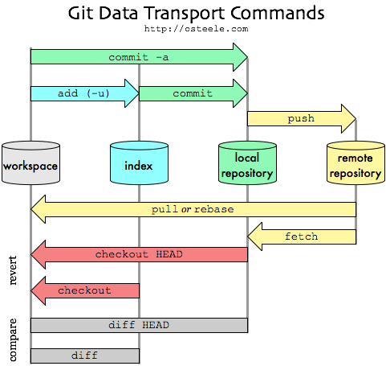
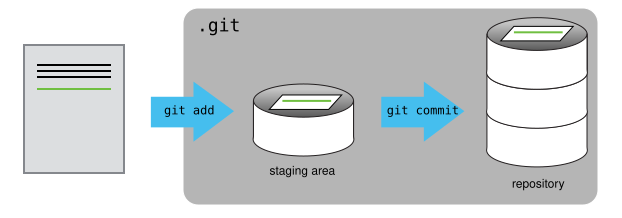

git의 명령어는 결국 **파일이 어느 "공간"에 있느냐를 옮기는 일**이다. `add`·`commit`·`push`를 따로 외우기보다, **4개의 공간 사이를 이동시키는 세 걸음**으로 보면 한눈에 잡힌다.

## 4개의 공간과 세 걸음

| 공간                     | 무엇인가                          | 여기로 보내는 명령        |
| ---------------------- | ----------------------------- | ----------------- |
| **작업 공간** (workspace)  | 지금 내가 파일을 편집하는 실제 폴더          | —                 |
| **스테이징** (index)       | 다음 커밋에 넣을 변경분을 **골라 담아두는 바구니** | `git add`         |
| **로컬 저장소** (`.git`)    | 내 컴퓨터에 커밋으로 **영구 저장**된 히스토리    | `git commit`      |
| **원격 저장소** (remote)    | GitHub 등 **서버에 올라간** 공유본       | `git push`        |

> **작업공간** ─`add`→ **스테이징** ─`commit`→ **로컬(.git)** ─`push`→ **원격(repo)**

이 한 줄이 전부다. 아래 그림이 이 흐름(과 되돌아오는 길)을 통째로 보여준다.



- 오른쪽으로 밀어 올리는 길: `add` → `commit` → `push`
- `commit -a`는 **`add`와 `commit`을 한 번에** (단, 이미 추적 중인 파일만).
- 왼쪽으로 되받는 길: `push`의 반대는 `pull`(= `fetch` + 병합/`rebase`), 즉 서버의 변경을 내 로컬로 당겨온다.

## 왜 스테이징이 따로 있나

가장 낯선 건 **스테이징(index)**이다. 작업공간에서 바로 커밋하면 될 것 같은데 왜 한 단계를 거칠까?

**"이번 커밋에 무엇을 담을지 내가 고르기 위해서."** 파일 10개를 고쳤어도, 그중 관련된 3개만 `add`해서 하나의 의미 있는 커밋으로 묶을 수 있다. 스테이징은 **커밋을 조립하는 작업대**인 셈이다.



```bash
git status              # 지금 각 파일이 어느 공간에 있는지 (핵심 명령)

git add <파일>          # 작업공간 → 스테이징 (이 파일을 다음 커밋에 넣겠다)
git add .               # 변경된 것 전부 스테이징

git commit -m "메시지"   # 스테이징 → 로컬(.git), 커밋으로 확정
git commit -am "메시지"  # 추적 중인 파일은 add+commit 한 번에

git push                # 로컬 → 원격
git push -u origin main # 최초 1회, 업스트림(추적 관계)까지 연결
```

## 되돌리기 — 어느 공간에서 빼느냐

되돌리기도 "어느 공간에서 물러나느냐"로 정리된다:

```bash
git restore --staged <파일>   # 스테이징 → 작업공간으로 (add 취소, 내용은 유지)
git restore <파일>            # 작업공간의 수정 자체를 버림 (되돌릴 수 없음, 주의)
```

그림 아래쪽의 `checkout HEAD`(revert 계열), `diff`/`diff HEAD`(compare 계열)도 결국 **어느 공간과 어느 공간을 비교/복원하느냐**의 문제다.

## 연결

- 명령어 전체 목록·브랜치는 [Git Basic](../python/git.md).
- `push`의 반대편(원격 → 로컬)에서 히스토리를 이어 붙이는 `pull --rebase`의 원리는 [Git rebase](./rebase.md). 그림의 왼쪽 화살표 `pull or rebase`가 바로 그것.
- `git revert`(반대 커밋을 새로 추가해 되돌림)와 위 `restore`의 차이도 [Git rebase](./rebase.md)에서 rebase와 비교해 정리해 둠.
