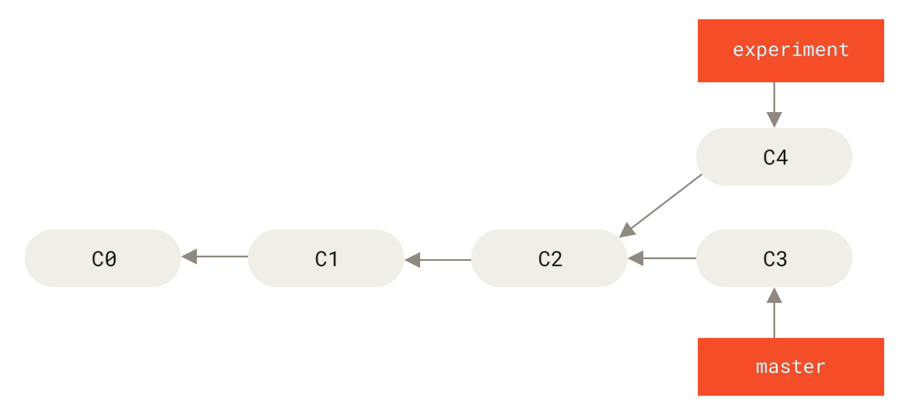
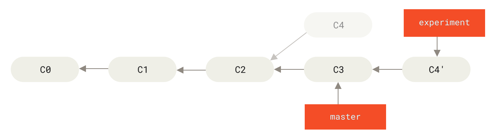

**rebase = re + base.** 브랜치의 "밑동(base)"을 다시(re-) 붙이는 작업이다. 지금 브랜치가 갈라져 나온 지점을, 대상 브랜치의 최신 커밋으로 **옮겨 심는다.**

## 한 줄 요약

- **merge**: 두 갈래를 합치는 **새 커밋(merge commit)**을 만든다. 갈라졌던 흔적이 히스토리에 그대로 남는다.
- **rebase**: 내 커밋들을 떼어내 대상 브랜치 **끝에 다시 붙인다.** 갈라진 흔적이 사라지고 **한 줄(linear)**이 된다. → 대신 커밋을 **새로 만들므로 히스토리가 바뀐다.**

[Git Basic](../python/git.md)의 `git merge`가 "합친 기록을 남기는" 쪽이라면, rebase는 "합친 적 없던 것처럼 이어 붙이는" 쪽이다.

## 그림으로

`experiment` 브랜치의 `C4`가 `master`의 `C3`와 갈라져 있는 상태에서 출발한다.



`experiment`에서 `git rebase master`를 실행하면 — `C4`의 변경분을 **`C3` 위에 다시 얹어** `C4'`라는 **새 커밋**으로 만든다. (`C4`는 버려지고 `C4'`는 내용은 같지만 커밋 ID가 다른 별개 커밋이다.)



```bash
git switch experiment
git rebase master        # experiment의 커밋들을 master 끝(C3) 위로 옮겨 심는다

git switch master
git merge experiment     # 이제 일직선이라 fast-forward로 깔끔히 합쳐짐
```

## 명령어

```bash
git rebase <대상브랜치>          # 현재 브랜치를 대상 끝으로 옮겨 심음
git rebase --onto A B <branch>  # B 이후의 커밋만 떼어 A 위로 (부분 이식)

# 충돌 났을 때 (커밋 하나씩 다시 얹다가 멈춤)
git status                      # 어디서 멈췄는지 확인 후 파일 수정
git add <파일>
git rebase --continue           # 해결하고 다음 커밋 진행
git rebase --skip               # 이 커밋 건너뛰기
git rebase --abort              # 통째로 취소, rebase 전으로 복귀
```

## interactive rebase — 히스토리 청소

`-i`(interactive)를 붙이면 커밋들을 **하나씩 골라 편집**할 수 있다. PR 올리기 전 지저분한 커밋을 정리하는 용도.

```bash
git rebase -i HEAD~4     # 최근 4개 커밋을 편집 대상으로 연다
```

에디터가 열리면 각 줄 앞의 명령어를 바꿔준다:

| 명령      | 뜻                              |
| ------- | ------------------------------ |
| `pick`  | 그대로 사용 (기본값)                   |
| `reword`| 커밋은 두되 **메시지만** 수정            |
| `squash`| **앞 커밋에 합침** + 메시지 둘 다 편집      |
| `fixup` | 앞 커밋에 합침, **메시지는 앞것만** 유지      |
| `drop`  | 커밋 삭제                          |
| `edit`  | 그 커밋에서 멈춰 내용 자체를 수정            |

예: `add login` / `fix typo` / `more css` 3개를 `squash`/`fixup`으로 묶으면 → 의미 있는 **1개 커밋**으로 줄어든다. 파일 내용은 그대로, 히스토리만 깔끔해진다.

## ⚠️ 황금률 — 공유된 커밋은 rebase 금지

rebase는 **커밋 ID를 새로 만든다**(히스토리 재작성). 이미 `push`해서 남들이 받아 간 커밋을 rebase하면, 남의 히스토리와 어긋나 충돌이 터진다.

> **내 로컬 브랜치(아직 안 밀었거나 나만 쓰는)에서만 rebase한다.** `main`/공유 브랜치엔 절대 하지 않는다.

[Git Basic](../python/git.md)의 `git revert`와 비교하면 차이가 분명하다 — revert는 "반대 커밋을 **새로 추가**"해 원래 기록을 남기는 안전한 방식(공유 브랜치 OK), rebase는 "원래 커밋을 **바꿔치기**"하는 방식(내 것만).
