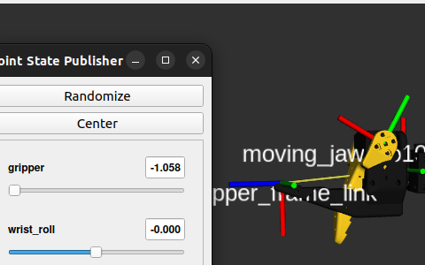
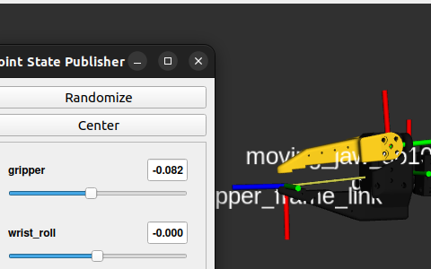

URDF 는 오픈 소스로 제공되는 파일을 사용.
캘리브레이션은 따로 설정 해줬기 때문에 limit 을 설정하는 부분만 고쳐 주었다.

## description build

urdf 를 받으면 파일 경로가 임의로 되어있는데 패키지화 하게 된다면 상대 경로로 묶어 포터블 하게 사용 가능하다.

### CMakeLists

비교적 간단한 `CMakeLists` 내부
`DIRECTORY` 는 경로를 생성
```CMakeList.txt
install(
    DIRECTORY
    urdf
    meshes
    launch
    rviz
    DESTINATION share/${PROJECT_NAME}
)
```

### display.launch.py

존재하는 urdf 파일을 ros2에서 제공 하는 기본 패키지인 `robot_state_publisher`, `joint_state_publisher_gui`, `rviz2` 를 함께 묶어서 실행 시키는 구조

```python

# robot_description 은 urdf경로를 가지고 있는 파라미터 이다.
# URDF를 읽어 로봇의 링크, 조인트 트리를 파악 /joint_states 를 받아 링크의 공간을 계산 - FK

return LaunchDescription([
	Node(
		package= 'robot_state_publisher',
		executable='robot_state_publisher',
		output='screen',
		parameters=[{'robot_description': robot_description}]
	), 
	# joint_state_publisher = /joint_state로 발행 되는 관절 슬라이더 패키지
	Node(
		package='joint_state_publisher_gui',
		executable='joint_state_publisher_gui'
	),
	Node(
		package='rviz2',
		executable='rviz2',
		arguments=['-d', rviz] #rviz = rviz2의 경로 변수
	)
])
```

## 캘리브레이션 문제

오픈소스로 제공 되는 패키지와 다르게 진행 되다 보니 URDF의 리밋 값이 내 로봇과 달라 수정 해주어야 했다. 제일 큰 문제는  모든 관절을 실물 중앙 값을 기준으로 캘리브레이션을 맞추다 보니 그리퍼의 offset이 거의 절반정도 밀려있었다. 제공되는 URDF 에선 그리퍼가 -10 ~100 도로 모터의 물리적 중앙 이 아니라 직교 상태를 중앙으로 보고 있었다.



위문제는 URDF 에서 -10 ~100 범위의 리밋을 보고 0점이 모터에 직교하는 자세라고 유추하여 진행 하였다.

> ros2_control 연결은 별도 노트로: SO-101, Phase0 ros2_control
